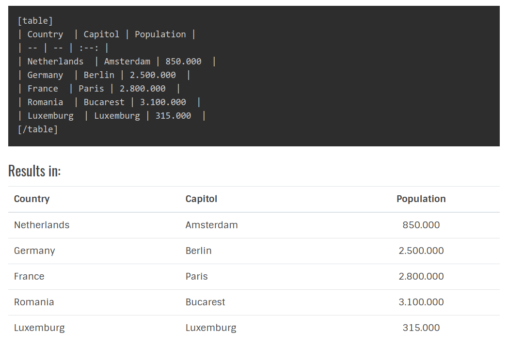

# Shortcodes Thunder #

## Documentation

### Shortcodes

| Shortcode | Description | Link | Status |
| --- | --- | --- | :---: |
| Alert | Nice Alerts | [documentation](shortcodes/alert.md) |  |
| Align | Easier way to align elements | [documentation](shortcodes/align.md) |  |
| BootstrapButton | Bootstrap buttons made easy | [documentation](shortcodes/bootstrapbutton.md) |  | 
| BootstrapTable | Easy conversion of markdown tables to Bootstrap  | [documentation](shortcodes/bootstraptable.md) | |
| Code | Enhancing code with linenumbers and hilites | [documentation](shortcodes/code.md) | |
| Color | Use colors in markdown | [documentation](shortcodes/color.md) | |
| Columns | Creates nice alerts | [documentation](shortcodes/columns.md) | |
| Div | Simply adding a div container wrapper | [documentation](shortcodes/div.md) | |
| Email | Easy to use email shortcode | [documentation](shortcodes/email.md) | |
| Figure | ??? | [documentation](shortcodes/figure.md) | |
| FontAwesome | Adding Fontawesome Icons to your markdown text | [documentation](shortcodes/fontawesome.md) | |
| H | Creating headers like '#', but with more options | [documentation](shortcodes/h.md) | |
| Lightbox | Well, if this wouldn't work (under construction) | [documentation](shortcodes/lightbox.md) | |
| Mark | Hilite text with markers | [documentation](shortcodes/mark.md) | |
| Notice | Creates nice alerts | [documentation](shortcodes/notice.md) | |
| Raw | ??? | [documentation](shortcodes/raw.md) | |
| SafeEmail | Obfuscates Email Addresses | [documentation](shortcodes/safeemail.md) | |
| Section | ??? | [documentation](shortcodes/section.md) | |
| Size | ??? | [documentation](shortcodes/size.md) | |
| Span | Use `<span>` tags | [documentation](shortcodes/span.md) | |
| Underline | Underlining made easier | [documentation](shortcodes/underline.md) | |
| Url | Creating URL's with more options | [documentation](shortcodes/url.md) | |
| Vimeo | Responsive Vimeo video | [documentation](shortcodes/vimeo.md) | |
| Wrap | Wrap an element with options | [documentation](shortcodes/wrap.md) | |
| Youtube | Responsive Youtube video | [documentation](shortcodes/youtube.md) | |

*  = OK to use
*  = still some sharp edges 
*  = not for production 


It colors your markdown code:


It creates nice notices:


It marks your keywords:


Bootstrap alerts:


Bootstrap tables



And much more...

## What does it do?
This plugin adds extra functionality to your markdown used in the blog plugin from Rainlab.
It is a work-under-construction as new shorcodes are added all the time. This plugin is not in the October CMS marketplace
and no support is offered. It comes as it is.

The name of the plugin is quite explosive, but that is while this plugin is based on [`thunderer/shortcode`](https://github.com/thunderer/Shortcode)
package of Tomasz Kowalczyk.

## How to install
This plugin is not available in the marketplace of October CMS, so you have to install it manually.

Clone this repository to the `plugins\enovision` folder and name it `shortcodesthunder`.

```
git clone https://github.com/enovision/october-cms-shortcodesthunder shortcodesthunder

cd shortcodesthunder

composer install
```

from within the plugins/enovision folder.

The `enovision` folder might not exist, so you have to create that first.
