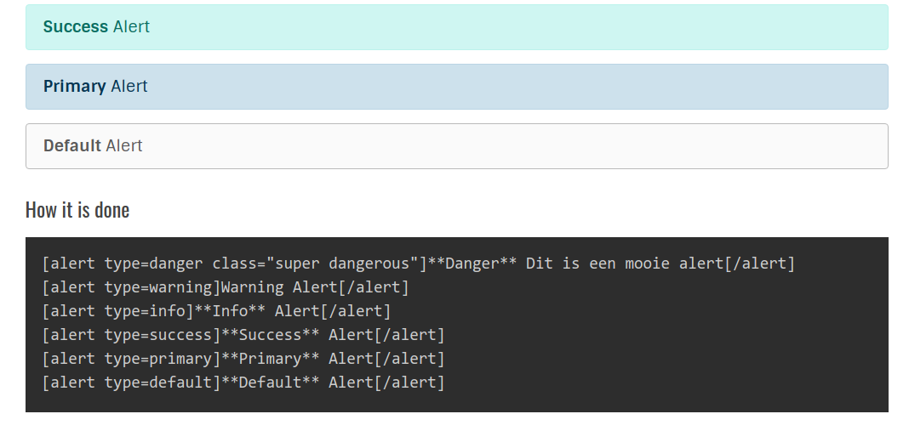

# Alert #

Shortcode: **alert**

## Purpose ##

bla bla

## Sample ##



## Usage ##

```
[alert type="info" class="more classes"]This is an alert[/alert]
```

## Structure and options ##

### Structure

| shortcode | optional | optional  | ] | content | /shortcode  |
| --- | --- | --- | --- | ---| ---|
| [alert  | [type="{type}"]  | class="{classes}" | ]  | {content} |  [/alert] |

### Options

| Parameter | Type | Required | Purpose | Values | Default | Sample |
| --- | --- | --- | --- | ---| ---| ---| 
| type | string | No | Uses the bootstrap color schemes | alert, danger, info, warning, primary, default | 'info'  | `[alert type="info"]This is an **info** alert[/alert]` |
| class | string | No | additional css classes delimited by ' ' |  | blank  | `[alert class="one two three"]Sample with class[/alert]` |


